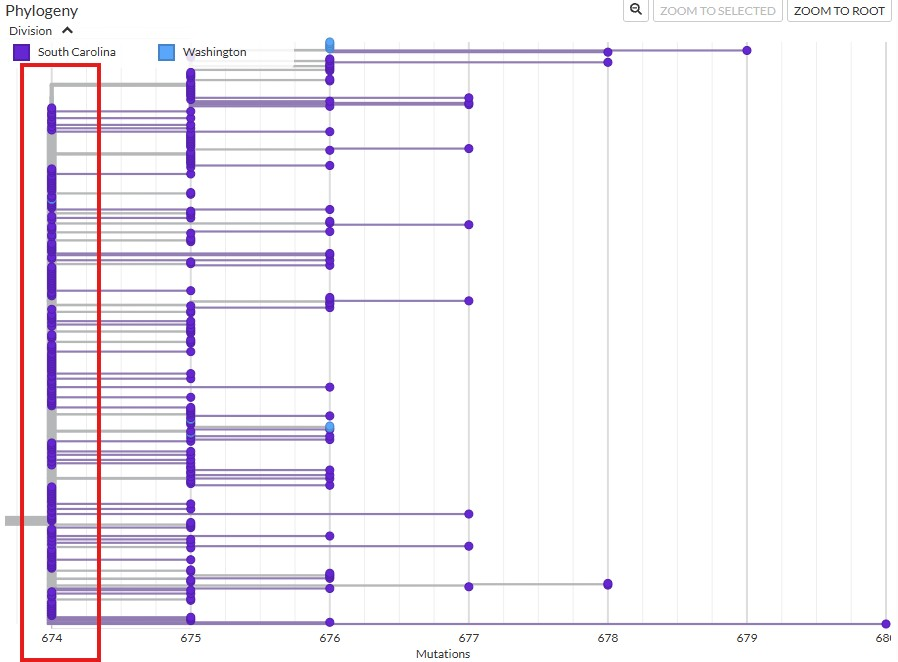
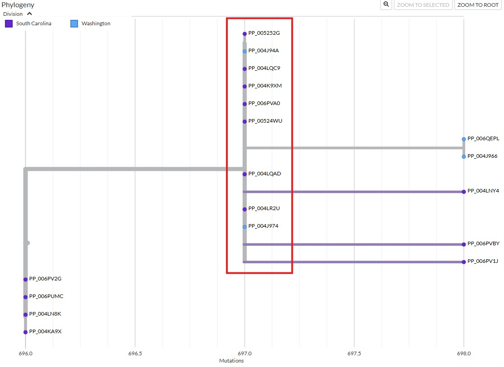
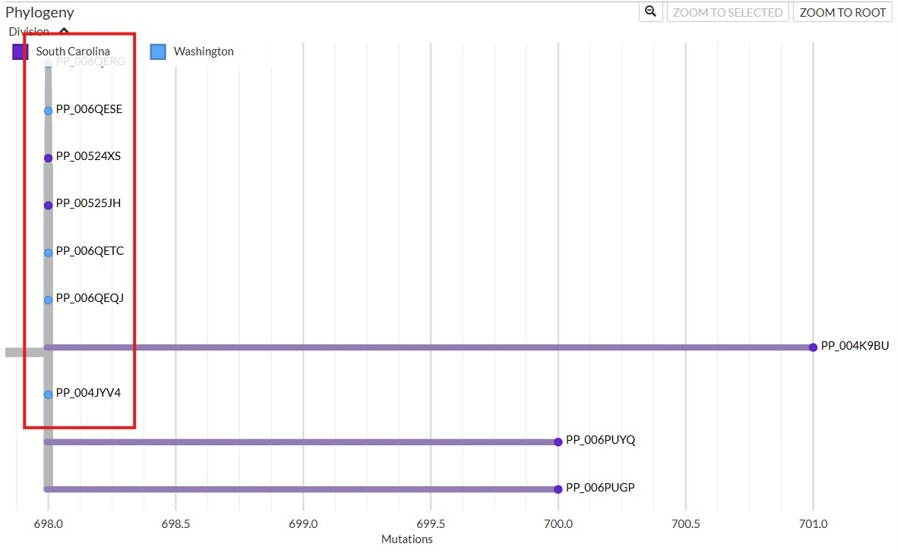

# Multiple domestic measles importations within a two-week period, Washington State, January 2026

## Alignments for Washington Sequences and Their Matches

This directory contains alignments of measles (MeV) genomes generated during the Washington State outbreak and genomes from the contextual (non-outbreak) genomes that they matched with 100% identity. These groups of sequences being aligned were grouped according to the polytomies in the phylogenetic tree.

The Washington sequences are available in the [seqset](https://pathoplexus.org/seqsets/PP_SS_1981.1) as focal samples, and the non-Washington-outbreak samples are in the same dataset as background samples.

Sequences were aligned using `augur align` to maintain consistency with the phylogenetic workflow:
```
augur align --sequences ./*.fa --output <county>.fasta
```

Aligments vizualization and stats were generated with a [web-based viewer](https://github.com/DOH-PNT0303/streamlit_align_and_view_app). These can be viewed by opening the `.html` folder within each subdirectory under `alignments`

### County A

County A and South Carolina genomes were aligned including the following sequences. These are all genomes aligning on the polytomy with the County A genome.



### County C

County C alignment consists of the samples indicated in this subtree.



### County D

The following sequences were included in the County D alignment:

